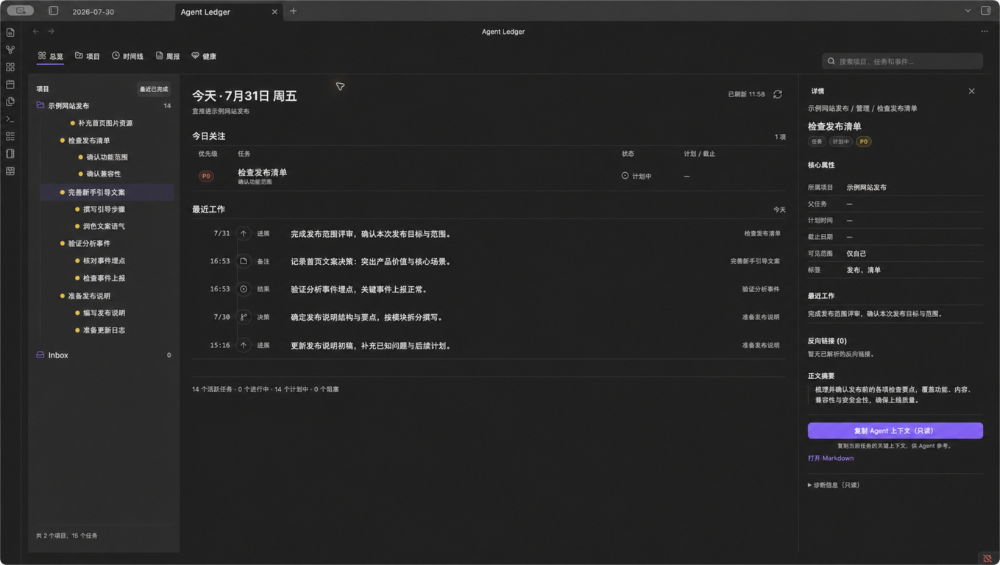
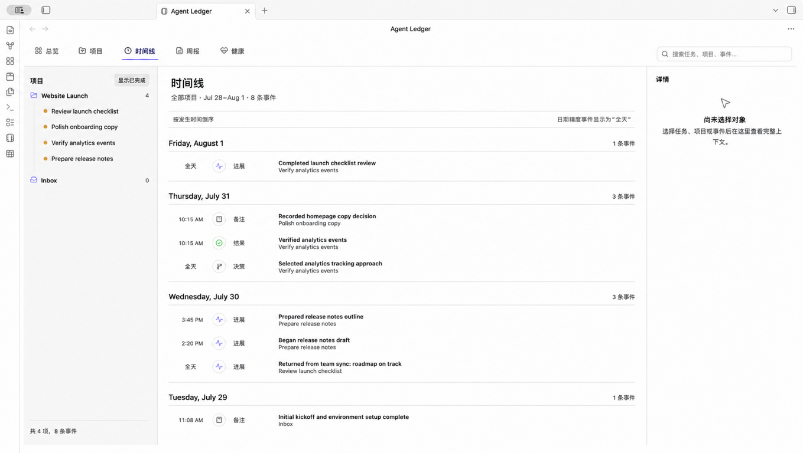
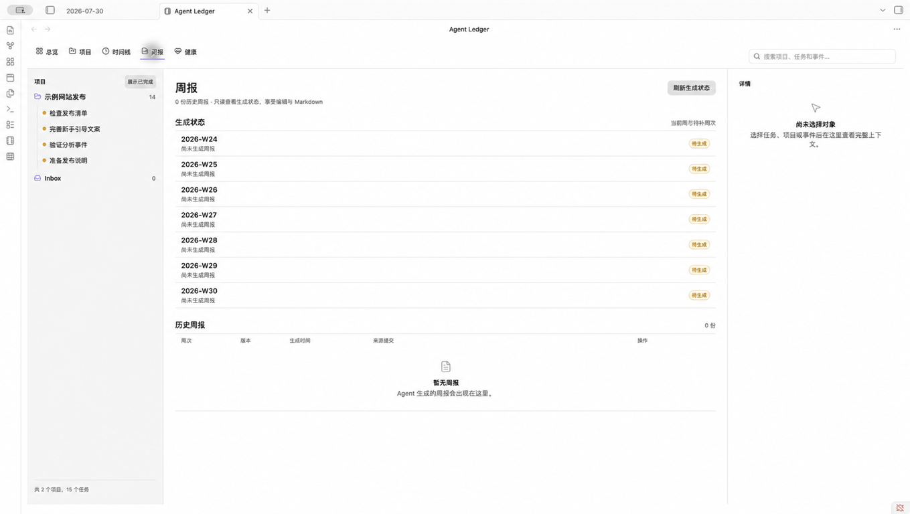

# Agent Ledger for Obsidian

See agent-assisted work clearly—projects, evidence, and weekly reports—in the
Obsidian Vault you already use.

Agent Ledger reads through Work Ledger and never edits managed Markdown.

[Install from Community Plugins](obsidian://show-plugin?id=agent-ledger) ·
[Quick start](#quick-start) · [How it works](#how-it-works)

## Make agent work easier to understand

Agent Ledger is for people who already use Obsidian and Work Ledger to manage
agent-assisted projects. It turns the structured data in your Vault into a
desktop workspace where you can:

- **Know what needs attention today.** See focus tasks, status counts, and
  recent work without opening every note.
- **Trace work back to evidence.** Follow projects, task hierarchy, effective
  events, source Markdown, native links, and backlinks.
- **Prepare updates with confidence.** Review report readiness and the facts
  behind a weekly report before sharing it.

## What you can do

- **Overview** brings today's focus and recent activity together across all
  projects.
- **Projects** makes root tasks and inherited child-task structure readable at
  a glance.
- **Timeline** turns corrected and compensated Journal entries into a clean,
  date-grouped history.
- **Reports** shows due status, report history, evidence facts, and clean
  Markdown or plain-text copy actions.
- **Health** explains CLI, protocol, schema, Vault, digest, Git HEAD, and doctor
  findings when something needs attention.

## Quick start

1. In Obsidian desktop `1.12.0` or newer, open **Settings → Community plugins**,
   search for **Agent Ledger**, then install and enable it. You can also use the
   [Community Plugins link](obsidian://show-plugin?id=agent-ledger).
2. Install an exact compatible `agent-ledger-harness` release that provides
   `work-ledger >=0.8,<1.0`, and prepare a schema 4 Work Ledger Vault. See the
   [setup guide](docs/setup.md) for supported installation and migration paths.
3. Open that same Vault in Obsidian. In **Settings → Agent Ledger**, enter the
   absolute path to the verified `work-ledger` executable. Add an absolute
   configuration path only if you do not use the CLI default.
4. Select the ribbon icon or run **Agent Ledger: Open** from the command palette.

## How it works

Agent Ledger asks the compatible `work-ledger` CLI for deterministic read
projections, then renders them inside Obsidian. Work Ledger remains the only
writer for managed Project, Task, Journal, and Report Markdown, so the plugin
does not introduce a second source of truth.

The open Obsidian Vault and the configured CLI Vault must have the same
SHA-256 identity. If they do not match, Agent Ledger clears its business state
before showing the error so information from another Vault is never displayed.

## Designed for trust

- The client exposes read and diagnostic operations only. Through Work Ledger,
  it may inspect local Git metadata and history. It never performs Git mutations,
  fetches, pushes, `sync`, `apply`, `migrate apply`, or
  `report write`, and it never writes managed Markdown directly.
- Settings persist runtime location and UI preferences, not Project, Task,
  Event, Report, CLI stdout, or Agent-context snapshots.
- **Copy Agent context** copies a scoped, read-only context block to your
  clipboard. It does not send anything to an agent automatically.
- Report export is a clean, read-only projection; migration support is limited
  to reviewing a plan.

## Requirements

| Requirement | Supported boundary |
|---|---|
| Obsidian | Desktop `1.12.0` or newer |
| Work Ledger | `work-ledger >=0.8,<1.0`, CLI protocol 1 |
| Vault | The same absolute Vault in the CLI and Obsidian |
| Data | Work Ledger Vault schema 4 |

To keep the public names distinct, install the `agent-ledger-harness` distribution
to provide the `work-ledger` executable for the
`work-ledger-cli >=0.8.0,<1.0.0` product. The sibling `work-ledger-cli` source tree
is only an automatic development fallback inside the monorepo.

The plugin does not install the CLI, initialize a real Vault, or apply a Vault
migration. Follow the [setup guide](docs/setup.md) for those steps.

## Troubleshooting

| What you see | What to do |
|---|---|
| **CLI missing** | Enter the absolute path to a verified `work-ledger` executable. Desktop apps do not reliably inherit your interactive shell `PATH`. |
| **Incompatible** | Install a compatible CLI and confirm protocol 1 exposes `snapshot`, `report.export`, `read_only_snapshot`, `clean_report_export`, and inherited child projects. |
| **Vault mismatch** | Open the Vault selected by the CLI configuration, or select the configuration for the Vault currently open in Obsidian. |
| **Migration required** | Generate and review a CLI migration plan. Agent Ledger never applies it. |
| **Stale** | Review Health, fix the reported runtime or data issue, then refresh manually. |

More detail is available in [Setup and troubleshooting](docs/setup.md).

## FAQ

### Does Agent Ledger work on mobile?

No. It requires Obsidian desktop because it launches a local CLI executable.

### Why is there no separate Graph page?

Managed wikilinks already work with Obsidian's native Graph and backlinks.
Agent Ledger focuses on project, timeline, report, and health views.

### Can the plugin change my Work Ledger data?

No. Agent Ledger is a read-only client. Use the Work Ledger CLI for controlled
writes, synchronization, report generation, and reviewed migrations.

### Does copying Agent context send it anywhere?

No. It only writes the selected context to your clipboard.

## For contributors

Development requirements, verification, packaging, standalone community-clone
behavior, and synthetic-Vault rules live in [CONTRIBUTING.md](CONTRIBUTING.md).

Agent Ledger is available under the [MIT License](LICENSE).
